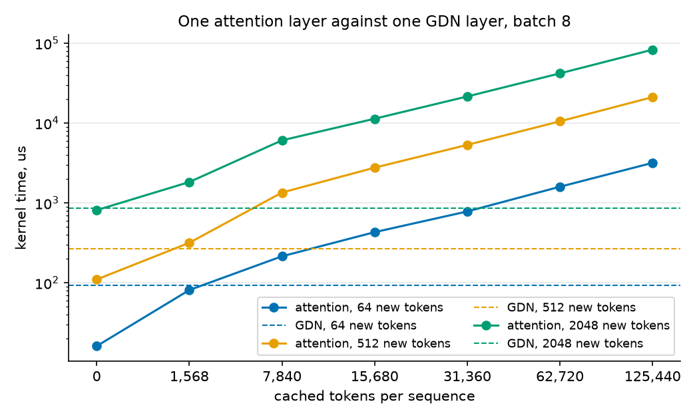
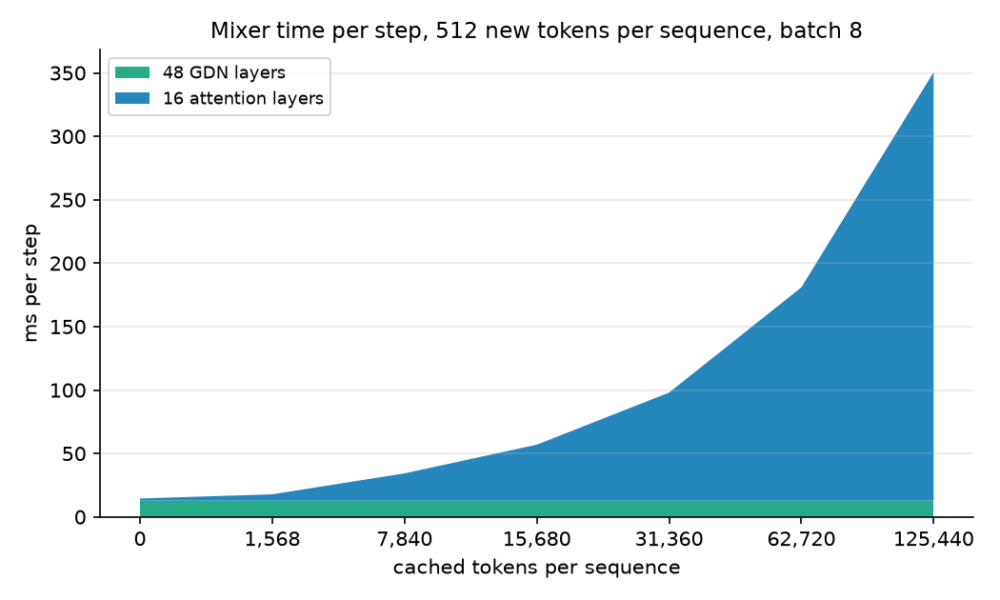
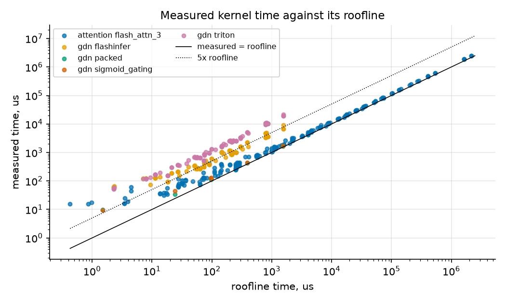

# Attention and Gated DeltaNet kernels of Qwen3.8-27B on an H200: shapes, warm caches and ragged batches

Work in progress. Sections 2 to 7 hold the day 1 measurements. The compiled mode census, the tokens per step distribution and sections 8 to 11 come on day 2.

## 1. Methodology

### 1.1 Hardware and software

| Item | Value |
|---|---|
| GPU | 1x NVIDIA H200 141GB on Verda, compute capability 9.0, 132 SMs, driver 580.178.04, 700 W power limit |
| Engine | vLLM 0.29.0, CUDA 13 image, digest recorded in `results/env/environment.json` |
| Kernel libraries | the FlashInfer, Triton and vendored linear attention kernels shipped inside that image |
| Model | `Qwen/Qwen3.8-27B-FP8`, text path only (`--language-model-only`) |
| Where benchmarks run | inside the same container as the engine, so kernel versions are identical |

### 1.2 Ceilings

All utilization numbers are relative to ceilings I measured on this GPU: device memory bandwidth from copy and reduction kernels at 1, 4 and 16 GiB, and BF16 and FP8 GEMM throughput at the model's largest projection shape. Vendor figures are listed beside them for reference only. I sample clocks and power during the ceiling runs and flag throttling.

### 1.3 Shape census

The census draws on three sources, which I diff against each other:

1. An analytic inventory from the model config. It follows vLLM's fused projection layout and carries per step counts (48 GDN layers, 16 attention layers, 64 MLPs). Alongside it is a table of shape variants under tensor parallel 1/2/4/8, fp8 KV, speculative decoding and prefix caching; variants other than the benchmarked configuration are labeled analytic only.
2. Torch profiler traces from the live server, taken in eager mode, where the operator shapes are visible, and in the default compiled CUDA graph mode, which shows the production kernel set with padded token counts.
3. The real distribution of prefill tokens, decode tokens and sequence count per engine step at concurrency 1, 8, 32 and 128, with prefix caching off and on.

The day 1 sweeps use a grid. Points at the observed percentiles come with the step distribution on day 2 and will be labeled as such.

### 1.4 Regimes

| Regime | Definition |
|---|---|
| Cold | no cached tokens |
| Warm, fraction view | context L in multiples of 7840 tokens; cached fraction 0, 0.5, 0.9, 0.99 aligned to the 784 token manager block; only new tokens are computed over the cached KV |
| Warm, fixed new view | 64, 512, 2048 new tokens over cached history 0 to 125440 tokens (whole 784 token blocks) |
| Ragged prefill | fixed total new tokens (4096, 16384) over 8, 32, 128 sequences; lengths uniform, 80 to 100 percent jitter, lognormal (sigma 1.0), bimodal, mixed prefill plus decode; fixed seeds |
| Ragged decode | one new token per sequence; KV lengths uniform, jitter, lognormal, bimodal at equal total KV tokens |

On the H200 vLLM selects FlashAttention 3, which runs directly on the 784 token blocks, so that is the page size I measure. Page sizes 16, 64 and 256 are measured as a comparison. For GDN the warm case passes a restored recurrent and conv state. The states come from an actual prefill of 0, 1k and 64k tokens.

### 1.5 Timing and correctness

I time each point with CUDA events: 10 warmup calls, 50 timed repeats, one synchronize per repeat batch and no L2 flush between repeats. I report the median with p10 and p90. If the spread exceeds 25 percent of the median I measure the point again once with double repeats and flag it if it is still unstable. Every point is also captured into a CUDA graph and replayed, whatever its length. The tables report the replay median as kernel time and eager minus replay as launch overhead. The numerics checks are GPU tests (`tests/test_gpu_attention_kernels.py`, `tests/test_gpu_gdn_kernels.py`) that I ran before the sweeps. They compare every backend against a plain PyTorch reference at a small shape. For GDN a final state fed back as the initial state must reproduce the uninterrupted result.

### 1.6 Derived metrics

From the causal aware FLOPs and bytes moved per call I derive achieved TFLOPS and GB/s, utilization against the measured ceilings, microseconds per new token, and the per step cost (x16 for attention, x48 for GDN). Ragged efficiency is the achieved rate of a ragged batch relative to the uniform batch with the same total tokens; for GDN, whose work is linear in tokens, that is the uniform time divided by the ragged time. The crossover is the cached history length where per layer attention time exceeds per layer GDN time at the same new token count.

### 1.7 Sum of parts

The sum of parts comparison comes on day 2. For each measured engine step composition, the predicted time is 48 x GDN + 16 x attention + supporting ops at the nearest benchmarked shapes. The difference to the measured step time is the unexplained residual. This sum is a bound rather than a model of the engine, because kernel overlap and framework work are not in it.

## 2. Shape census

### 2.1 What the engine selected on this GPU

These values come from the vLLM startup log. The parsed record is `results/census/server_config.json`.

| Decision | Value |
|---|---|
| Attention backend | FLASH_ATTN, FlashAttention version 3 (candidates were FLASH_ATTN, FLASHINFER, TRITON_ATTN, FLEX_ATTENTION) |
| GDN prefill kernel | FlashInfer |
| GDN decode kernel for plain decode | Triton packed recurrent kernel. The log names a CUDA kernel, which the vLLM source only uses on speculative decoding batches; the eager trace shows only the Triton kernel in the decode steps |
| FP8 GEMM kernel | FlashInferFp8DeepGEMMDynamicBlockScaledKernel |
| KV manager block | 784 tokens, chosen so an attention page is at least as large as a GDN state page |
| Attention kernel page | 784 tokens. FlashAttention accepts any multiple of 16, so it runs directly on the manager block. FlashInfer would have run on a smaller kernel page |
| Prefix caching | on, mode align. GDN state is checkpointed only at block boundaries |
| Chunked prefill budget | 8192 tokens per step |
| KV cache capacity | 1400832 tokens |

The profiler trace (section 2.3) confirmed two consequences of these choices. A 1001 token prompt was scheduled as 784 + 217 tokens (align mode chunking), and the GEMM kernels carry the fused shapes listed below rather than the checkpoint tensor shapes.

### 2.2 Analytic operator inventory

I derived this inventory from the model config (`configs/qwen3.8-27b-fp8.config.json`) using vLLM's fused projection layout. The full table is in `results/census/analytic_ops.md`, and a machine readable copy is in `results/census/analytic_ops.json`.

| | Value |
|---|---|
| Layers | 64: 48 GDN and 16 full attention, attention at layers 3, 7, 11, ..., 63 |
| Operator types | 28 (two added after the observed census, see 2.3) |
| GEMMs per GDN layer | `in_proj_qkvz` 5120 to 16384, `in_proj_ba` 5120 to 96 (BF16), `out_proj` 6144 to 5120 |
| GEMMs per attention layer | `qkv_proj` 5120 to 14336 (query with output gate, key, value), `o_proj` 6144 to 5120 |
| GEMMs per MLP | `gate_up_proj` 5120 to 34816, `down_proj` 17408 to 5120 |
| GDN state per sequence per layer | recurrent 3 MiB fp32, conv 60 KiB |
| KV cache per token | 64 KiB across the 16 attention layers |
| Language model weights | 29.5 GB predicted. The checkpoint is 30.9 GB including the vision tower (about 0.9 GB) and the speculative head (about 0.5 GB), so the match is within 0.2 percent |

The checkpoint stores the GDN projections as four tensors (qkv, z, a, b), and vLLM fuses them into two GEMMs. A census built from tensor names would list five GEMMs per GDN layer at the wrong shapes.

### 2.3 Observed kernels, eager mode

I took one torch profiler trace of the live server, started with `--enforce-eager` and `record_shapes`, over a 1001 token prompt and seven decode steps. `bench.census.trace_parser` joins every GPU kernel to the operator that launched it (with the operator's input shapes), to the Python module frames open at launch time, and to the engine step it ran in. `bench.census.diff` then matches the kernels to the analytic inventory. GEMMs are matched by K and N from the recorded shapes, and everything else by name and block. The outputs are `results/census/observed_ops.csv`, `observed_summary.md` and `census_diff.md`.

| step | kernel launches | distinct kernels | GPU kernel time |
|---|---:|---:|---:|
| prefill chunk of 784 tokens | 3415 | 61 | 63.1 ms |
| prefill chunk of 217 tokens | 3665 | 62 | 26.2 ms |
| decode, 1 sequence (mean of 7 steps) | 2668 | 46 | 11.6 ms |

Every observed kernel is explained either by an inventory op or by engine work outside the model (input preparation, sampling). Together these account for 100 percent of the kernel time in every step. The per step kernel counts match the inventory: 64, 64, 16, 16, 48 and 48 launches for six of the seven projection GEMMs, 48 for the conv, 48 for the gated norm and 256 for the activation quantization. `in_proj_ba` shows 96 because cuBLAS runs it as a split K kernel plus a reduce. The trace also showed several things that the config alone does not:

- In eager mode each RMSNorm call runs as 13 small kernels (copies, mean, pow, rsqrt, mul, add), which adds up to 1674 launches per step for 129 norms and 2.7 ms of the 11.6 ms decode step. The compiled mode fuses these.
- The q norm, k norm, rotary and output gate split run as one Triton kernel, `_fused_qk_rmsnorm_rope_gate_kernel`, rather than as four separate ops.
- The FlashInfer chunked delta rule runs as four kernels per layer in prefill (an MN precompute, a T precompute, the prefill and a fixup kernel), while the packed recurrent decode is a single kernel.
- At M of 1 the FP8 GEMM is DeepGEMM's `swapAB` kernel, and the activation quantization runs inside the GEMM op as a TensorRT-LLM `scale_1x128` kernel. At M of 784 the GEMM is the `sm90_fp8_gemm_1d2d` kernel with a separate `per_token_group_quant` kernel in front.
- The eager prefill path gathers the initial recurrent state of every sequence with an `aten::index` over the whole state pool (2052 slots of 48 x 128 x 128 fp32) before the chunked kernel. After the kernel, an index put writes the final state back. Each layer runs one of each. Neither was in my inventory, so I added `state_gather` and `state_checkpoint` (the prefix caching copies at block boundaries, one fused kernel per step) after the diff flagged them.
- My inventory had the activation quantization at 304 per step because it counted `in_proj_ba` as FP8. The trace shows 256, because that projection stays BF16. The inventory now says 256.

The decode step in eager mode runs 2668 kernels for 11.6 ms of GPU time in a step window of about 119 ms (read off the step annotation in the trace). The step is launch bound, which is why the engine serves decode from CUDA graphs.

## 3. Ceilings

I measured the ceilings on the instance with `bench.core.ceilings` and recorded them in `results/env/ceilings.json`. A ceiling is the best burst observed, so no later measurement can exceed it by noise alone. The sustained rate is reported next to it.

| Ceiling | Measured | Vendor figure |
|---|---|---|
| HBM bandwidth | 4277 GB/s (device copy, 4 GiB) | 4800 GB/s |
| BF16 GEMM | 716 TFLOPS peak, 673 sustained | 989 TFLOPS dense |
| FP8 GEMM | 1452 TFLOPS peak | 1979 TFLOPS dense |

The GEMM shape is 16384 x 5120 x 34816, the model's largest projection. The FP8 number comes from `torch._scaled_mm` with a per tensor scale. That is not the block scaled kernel the model uses; it is the ceiling, and the model's block scaled GEMMs are measured against it. Read bandwidth from a reduction reaches 3578 GB/s, lower than the copy, so the copy sets the ceiling.

Under sustained load the GPU sits at its 700 W power cap (693 W drawn) and the SM clock drops to 73 percent of its maximum. This is power capping rather than thermal throttling; the driver reports no slowdown event. Every sustained number in this study is taken in that state, which is also the state a serving engine runs in.

## 4. Attention results

The kernel under test is FlashAttention 3 through vLLM's own build, with a paged KV cache of 784 token pages, 24 query heads over 4 KV heads and head dim 256. Kernel times are GPU time from CUDA graph replay. The eager call adds 20 to 30 us of host time at the small shapes (section 4.1) and nothing measurable at the large ones. There are 16 attention layers per step. The raw rows are in `results/raw/attention_*.jsonl`.

### 4.1 Cold prefill

There are no cached tokens in this sweep, so every query attends causally over its own sequence.

| tokens per sequence | batch | kernel us | us per token | TFLOPS (share of BF16 ceiling) |
|---:|---:|---:|---:|---:|
| 128 | 1 | 15 | 0.120 | 13 (2%) |
| 128 | 16 | 36 | 0.018 | 89 (12%) |
| 512 | 1 | 45 | 0.088 | 72 (10%) |
| 512 | 16 | 192 | 0.023 | 269 (38%) |
| 1024 | 1 | 34 | 0.034 | 376 (52%) |
| 1024 | 16 | 449 | 0.027 | 459 (64%) |
| 4096 | 1 | 350 | 0.086 | 589 (82%) |
| 4096 | 16 | 5882 | 0.090 | 561 (78%) |
| 16384 | 1 | 5159 | 0.315 | 639 (89%) |
| 16384 | 16 | 84366 | 0.322 | 626 (87%) |
| 65536 | 1 | 82265 | 1.255 | 642 (90%) |

Attention becomes compute bound quickly. From 1k tokens the kernel runs above half of the measured BF16 GEMM ceiling, and at 16k tokens and beyond it is near 90 percent of it. The cost per token grows with sequence length because each new token attends over everything before it.

Below about 1k tokens at batch 1 the eager call costs 45 to 52 us no matter the size. The GPU time from graph replay is 15 to 45 us, so a third to two thirds of the eager time is host work: the Python wrapper and the launch of `flash_attn_varlen_func`. The scheduler metadata is computed once outside the timed call, which is what vLLM does per step. This is the regime a 64 or 128 token chunk of a warm prefill lands in. The 512 token point measured 45 us of GPU time against 34 us for 1024 tokens. I keep the row as measured and note it as an outlier of the graph replay measurement instead of smoothing it.

### 4.2 Decode

Each sequence produces one new token that attends over its full KV history. The whole KV of every sequence is read once, so decode is bound by KV bandwidth.

| KV tokens per sequence | batch | kernel us | KV GB/s (share of HBM ceiling) | 16 layers, ms |
|---:|---:|---:|---:|---:|
| 1024 | 1 | 17.3 | 243 (6%) | 0.28 |
| 1024 | 64 | 76.8 | 3514 (82%) | 1.23 |
| 1024 | 256 | 279.3 | 3867 (90%) | 4.47 |
| 4096 | 1 | 19.2 | 874 (20%) | 0.31 |
| 4096 | 64 | 262.5 | 4096 (96%) | 4.20 |
| 4096 | 256 | 1074.0 | 4005 (94%) | 17.18 |
| 16384 | 1 | 38.7 | 1735 (41%) | 0.62 |
| 16384 | 64 | 1063.5 | 4040 (94%) | 17.02 |
| 16384 | 256 | 4305.6 | 3992 (93%) | 68.89 |
| 65536 | 1 | 95.1 | 2823 (66%) | 1.52 |
| 65536 | 64 | 4191.3 | 4099 (96%) | 67.06 |
| 65536 | 256 | 17020.4 | 4038 (94%) | 272.33 |
| 131072 | 1 | 149.2 | 3599 (84%) | 2.39 |
| 131072 | 64 | 8362.6 | 4109 (96%) | 133.80 |
| 131072 | 256 | 34576.0 | 3975 (93%) | 553.22 |

At small batch the kernel cannot fill the GPU, so bandwidth utilization is low. From batch 64 at 4k tokens upward it runs at 93 to 96 percent of the copy ceiling, and one point (16k tokens, batch 16) reaches 4323 GB/s, 1 percent above it. Attention decode is almost pure reading, and a read only stream can beat a copy, so the copy figure is a reference here rather than a hard bound. Compared with GDN decode at the same batch (section 5.1), attention decode cost grows with context length while GDN decode cost does not. At batch 64, attention over 131k tokens costs 8.4 ms per layer against 0.11 ms for a GDN layer.

### 4.3 Warm cache

Prefix caching leaves the KV of the cached prefix in place and computes only the new tokens, which attend over the whole context. I show two views of the same kernel. The first is the fraction view at batch 8: a context of L tokens of which 0, 50, 90 or 99 percent are already cached (rounded down to whole 784 token blocks).

| context | cached fraction | cached | new | kernel us | us per new token |
|---:|---:|---:|---:|---:|---:|
| 7840 | 0 | 0 | 7840 | 9944 | 0.159 |
| 7840 | 0.5 | 3920 | 3920 | 7423 | 0.237 |
| 7840 | 0.9 | 7056 | 784 | 1900 | 0.303 |
| 15680 | 0 | 0 | 15680 | 38712 | 0.309 |
| 15680 | 0.5 | 7840 | 7840 | 28805 | 0.459 |
| 15680 | 0.9 | 14112 | 1568 | 7593 | 0.605 |
| 15680 | 0.99 | 14896 | 784 | 3782 | 0.603 |
| 31360 | 0 | 0 | 31360 | 153844 | 0.613 |
| 31360 | 0.9 | 28224 | 3136 | 30212 | 1.204 |
| 31360 | 0.99 | 30576 | 784 | 7833 | 1.249 |
| 62720 | 0 | 0 | 62720 | 619332 | 1.234 |
| 62720 | 0.9 | 56448 | 6272 | 117778 | 2.347 |
| 62720 | 0.99 | 61936 | 784 | 15614 | 2.490 |
| 125440 | 0 | 0 | 125440 | 2467286 (eager) | 2.459 |
| 125440 | 0.9 | 112896 | 12544 | 472837 | 4.712 |
| 125440 | 0.99 | 123872 | 1568 | 62870 | 5.012 |

A 90 percent warm cache cuts the attention time of a 7840 token context by 5.2x rather than 10x. The 784 new tokens each attend over all 7840, so the cost per new token is twice that of the cold prefill, where the average token attends over half the context. The same effect, and not the cache, makes the kernel a good deal slower per new token at 125k than at 7k. The one value marked eager is an eager median; that point's graph capture ran into the point timeout.

The fixed new token view is the one the crossover in section 6 uses. The table gives kernel us for 64, 512 and 2048 new tokens per sequence over a cached history, and the last column gives the GDN kernel at the same new tokens and batch (FlashInfer, restored state):

| new tokens | batch | cached 0 | 1568 | 7840 | 15680 | 31360 | 62720 | 125440 | GDN layer |
|---:|---:|---:|---:|---:|---:|---:|---:|---:|---:|
| 64 | 1 | 16 | 24 | 38 | 70 | 115 | 190 | 352 | 61 |
| 64 | 8 | 16 | 81 | 214 | 430 | 781 | 1593 | 3172 | 92 |
| 64 | 32 | 35 | 153 | 692 | 1356 | 2711 | 5356 | 10806 | 309 |
| 512 | 1 | 62 | 80 | 236 | 410 | 765 | 1562 | 2978 | 121 |
| 512 | 8 | 110 | 316 | 1347 | 2762 | 5327 | 10512 | 21116 | 266 |
| 512 | 32 | 382 | 1339 | 5496 | 10763 | 21665 | 42508 | 83272 | 995 |
| 2048 | 1 | 134 | 242 | 748 | 1377 | 2792 | 5439 | 10498 | 209 |
| 2048 | 8 | 811 | 1825 | 6071 | 11330 | 21525 | 41886 | 82960 | 853 |
| 2048 | 32 | 3237 | 7193 | 23572 | 43861 | 84380 | 166378 | 330375 | 3670 |

Time is linear in the cached length from about 8k on. The surprise for me was where the bound sits: at 512 new tokens and batch 8 the kernel runs at 81 to 84 percent of the BF16 GEMM ceiling for every cached length from 1.5k to 125k. Warm attention with a few hundred new tokens is compute bound rather than KV bandwidth bound, because with 24 query heads over 4 KV heads and 512 queries every KV element loaded is used by 3072 query rows. Only the one token decode case (section 4.2) is bandwidth bound. Prefix caching saves the prefill of the cached tokens, but the new tokens still pay the full attention over them.

Five fraction view points at batch 32 with contexts of 62720 and 125440 tokens, and two at batch 8, had calls of 1.9 to 10 seconds. Two of them were recorded as timeouts. The other five kept their eager median because the timeout hit during graph capture and the capture fallback swallowed it. The timer now synchronizes per call for calls over 100 ms and the timeout can no longer be swallowed, but the day 1 sweeps ran before that fix. The fixed new token view covers the same cached lengths, so nothing is missing for the crossover.

### 4.4 Ragged batches

Attention work grows with the square of a sequence's length, so a batch with one long sequence has more real work than a uniform batch of the same total tokens. For that reason I compare the achieved rate (causal aware TFLOPS) rather than time. The batches have 16384 new tokens spread over 8, 32 and 128 sequences, with the lengths drawn with a fixed seed:

| sequences | distribution | length cv | max / mean length | kernel us | TFLOPS |
|---:|---|---:|---:|---:|---:|
| 8 | uniform | 0 | 1.0 | 684 | 603 |
| 8 | jitter | 0.05 | 1.1 | 788 | 525 |
| 8 | lognormal | 0.58 | 1.8 | 1016 | 545 |
| 8 | bimodal | 1.13 | 4.0 | 1626 | 580 |
| 32 | uniform | 0 | 1.0 | 388 | 266 |
| 32 | jitter | 0.06 | 1.1 | 330 | 314 |
| 32 | lognormal | 0.91 | 4.6 | 435 | 433 |
| 32 | bimodal | 2.69 | 16.0 | 1533 | 556 |
| 128 | uniform | 0 | 1.0 | 199 | 130 |
| 128 | jitter | 0.06 | 1.1 | 218 | 120 |
| 128 | lognormal | 1.41 | 10.7 | 292 | 265 |
| 128 | bimodal | 5.59 | 64.0 | 1478 | 562 |

Raggedness by itself costs FlashAttention little: at 8 sequences the rate stays within 13 percent of the uniform batch across all mixes. What moves the rate is the length of the individual sequences. A batch of 128 uniform sequences of 128 tokens runs at 130 TFLOPS because a 128 token sequence has little work per KV byte. The bimodal batch with the same 128 sequences runs at 562 TFLOPS because one 8k sequence carries most of the work. A ragged batch with a few long sequences is a good batch for attention; a uniform batch of short ones is not. The mixed distribution (half the sequences are single decode tokens over a 16k history) adds KV reading that the FLOP rate does not see, so I list it separately: 1466 us at 8 sequences, 718 at 32 and 1385 at 128.

The ragged decode sweep runs one new token per sequence over KV lengths with a mean of 16384:

| sequences | distribution | length cv | kernel us | KV GB/s |
|---:|---|---:|---:|---:|
| 16 | uniform | 0 | 248 | 4328 |
| 16 | jitter | 0.05 | 390 | 2753 |
| 16 | lognormal | 0.73 | 356 | 3020 |
| 16 | bimodal | 1.81 | 288 | 3725 |
| 64 | uniform | 0 | 1146 | 3751 |
| 64 | jitter | 0.06 | 1077 | 3989 |
| 64 | lognormal | 1.30 | 1413 | 3041 |
| 64 | bimodal | 3.91 | 1138 | 3774 |
| 256 | uniform | 0 | 4222 | 4071 |
| 256 | jitter | 0.07 | 4284 | 4012 |
| 256 | lognormal | 1.28 | 5152 | 3336 |
| 256 | bimodal | 7.95 | 4301 | 3995 |

Here the total work is the same, since the KV of every sequence is read once, so time is the right comparison. A lognormal mix of KV lengths costs 22 to 23 percent over uniform at 64 and 256 sequences, while bimodal costs almost nothing. At 16 sequences the picture is noisier: a 5 percent jitter is 57 percent slower than uniform. I think this is FlashAttention's split KV. It splits long KV across CTAs to fill the GPU (the trace shows its combine kernel), and the split count comes from the scheduler metadata, which sees the batch and the longest sequence. At 16 sequences that choice is on a knife edge; I have not confirmed it kernel side. GDN decode has no such dependence, because its state is the same size for every sequence (section 5.1).

### 4.5 Page size

vLLM's manager block is 784 tokens on this GPU and FlashAttention 3 runs directly on it. Would a smaller kernel page matter? The sweep runs 512 new tokens over 1568, 15680 and 62720 cached tokens, and decode over 16384 tokens at batch 64:

| point | page 16 | page 64 | page 256 | page 784 |
|---|---:|---:|---:|---:|
| 512 new over 1568 cached, batch 1 | 79 | 105 | 93 | 91 |
| 512 new over 1568 cached, batch 8 | 314 | 350 | 331 | 352 |
| 512 new over 15680 cached, batch 1 | 395 | 405 | 416 | 423 |
| 512 new over 15680 cached, batch 8 | 2593 | 2645 | 2663 | 2646 |
| 512 new over 62720 cached, batch 1 | 1506 | 1495 | 1493 | 1493 |
| 512 new over 62720 cached, batch 8 | 10130 | 10163 | 10250 | 10245 |
| decode, 16384 KV, batch 64 | 1062 | 1066 | 1086 | 1065 |

The pages are within a few percent of each other from 15680 cached on and within noise for the long contexts. At 1568 cached the kernel is so short (79 to 105 us at batch 1) that the spread comes from launch geometry rather than page size; there is no trend across pages. The page size is a memory management decision here rather than a kernel performance one. On a GPU where vLLM picks FlashInfer and a smaller kernel page, this table says that costs nothing.

## 5. GDN results

All kernel times in this section are GPU time from CUDA graph replay. I report eager time minus graph time as launch overhead. The raw rows are in `results/raw/gdn_*.jsonl` and the tidy tables in `results/processed/`. The model runs 48 GDN layers per step.

### 5.1 Decode

This table covers the packed recurrent kernel, which is the engine's plain decode path, with the causal conv update in front. The state is 3.2 MB per sequence per layer (3 MiB recurrent plus 60 KiB conv) and is read and written once per step, so decode is bound by state bandwidth.

| batch | kernel us | launch us | state GB/s (share of ceiling) | 48 layers, ms | sigmoid gating variant us |
|---:|---:|---:|---:|---:|---:|
| 1 | 9.8 | 60 | 661 (15%) | 0.47 | 9.6 |
| 16 | 34.1 | 43 | 3038 (71%) | 1.64 | 45.0 |
| 64 | 113.2 | 1 | 3656 (85%) | 5.44 | 125.2 |
| 256 | 421.8 | 1 | 3925 (92%) | 20.25 | 440.0 |
| 1024 | 1656.7 | 1 | 3998 (93%) | 79.52 | 1707.9 |

At batch 1024 the kernel moves 6.6 GB in 1.66 ms, which is 93 percent of the measured HBM ceiling. At batch 1 the kernel itself is 9.8 us but the launch costs 60 us; the engine hides that only when the GPU is busy with other work.

Decode time does not depend on how the state was produced: at batch 64 the kernel takes 113 us with fresh states, 123 us after a 1024 token history and 113 us after a 65536 token history.

### 5.2 Cold prefill

This table covers the conv, the gating and the chunked gated delta rule for a single sequence at batch 1.

| tokens | FlashInfer kernel us | us per token | launch us | Triton kernel us |
|---:|---:|---:|---:|---:|
| 128 | 66 | 0.512 | 338 | 59 |
| 512 | 121 | 0.237 | 283 | 118 |
| 1024 | 137 | 0.134 | 272 | 196 |
| 4096 | 347 | 0.085 | 66 | 697 |
| 16384 | 1186 | 0.072 | 20 | 2659 |
| 65536 | 4874 | 0.074 | 15 | 11251 |

The kernel settles at about 0.07 us per token per layer from 4k tokens up, so the 48 GDN layers cost about 57 ms for a 16k token prefill. Below 1k tokens the fixed cost dominates. The FlashInfer kernel is faster than the Triton one at every length past 512 tokens.

### 5.3 Warm state

This sweep prefills a fixed number of new tokens on top of a restored state. The states come from an actual prefill of 0, 1024 and 65536 tokens, so history independence is measured rather than assumed. The table shows the FlashInfer kernel at batch 8, in kernel us:

| new tokens | history 0 | history 1024 | history 65536 |
|---:|---:|---:|---:|
| 64 | 92 | 92 | 92 |
| 512 | 266 | 266 | 265 |
| 2048 | 851 | 853 | 851 |

The columns are equal within noise. Loading the state costs the same whatever history produced it, because the state has a fixed size. This is the property the hybrid design relies on, and it holds in the kernel the engine runs.

### 5.4 Ragged batches

This sweep spreads 16384 new tokens over 32 sequences, with the lengths drawn from five distributions with a fixed seed. Efficiency is the achieved rate relative to the uniform batch. GDN work is linear in tokens, so this is the uniform time divided by the ragged time.

| distribution | length cv | FlashInfer us | efficiency | Triton us | efficiency |
|---|---:|---:|---:|---:|---:|
| uniform | 0.00 | 994 | 1.00 | 2529 | 1.00 |
| jitter | 0.06 | 1009 | 0.99 | 2582 | 0.98 |
| lognormal | 0.91 | 1010 | 0.98 | 2583 | 0.98 |
| bimodal | 2.69 | 1024 | 0.97 | 2635 | 0.96 |
| mixed | 1.00 | 1009 | 0.99 | 2579 | 0.98 |

The chunked kernels lose at most a few percent to raggedness here, including the mixed case where half the sequences are single decode tokens. The worst case in the whole sweep is 12 percent, for the Triton kernel with 4096 tokens over 32 sequences in the bimodal distribution. Work is scheduled in fixed token chunks along the concatenated sequence (64 tokens in the Triton kernel; I have not checked the FlashInfer kernel's chunk size), so the length mix hardly matters as long as the total is the same.

### 5.5 Two kernel limits found on the way

In my first runs both chunked kernels faulted with an illegal memory access on very large single calls, FlashInfer at 501760 tokens and Triton at 250880 tokens. The engine caps a prefill step at 8192 tokens on this GPU, so this cannot happen in serving. The benchmark now refuses calls above 131072 tokens and records them as unsupported; those are the four unsupported rows in the kept results.

## 6. Attention versus GDN

The two mixers computed the same new tokens at the same batch in the warm sweeps. GDN time does not depend on the history, while attention time grows with it. `analysis.crossover` finds the cached length where one attention layer costs as much as one GDN layer, by linear interpolation between measured points, and the cached length where the whole step crosses with the model's layer counts of 16 attention layers against 48 GDN layers. The output is in `results/processed/crossover.md`.

| new tokens | batch | GDN layer us | attention layer us at 0 cached | at 125k cached | layer crossover, cached tokens | step crossover, cached tokens | attention share of mixer time at 125k |
|---:|---:|---:|---:|---:|---:|---:|---:|
| 64 | 1 | 61 | 16 | 352 | 13490 | 60314 | 66% |
| 64 | 8 | 92 | 16 | 3172 | 2109 | 10135 | 92% |
| 64 | 32 | 309 | 35 | 10806 | 3384 | 10626 | 92% |
| 512 | 1 | 121 | 62 | 2978 | 3209 | 13544 | 89% |
| 512 | 8 | 266 | 110 | 21116 | 1182 | 4490 | 96% |
| 512 | 32 | 995 | 382 | 83272 | 1004 | 4049 | 97% |
| 2048 | 1 | 209 | 134 | 10498 | 1097 | 6346 | 94% |
| 2048 | 8 | 853 | 811 | 82960 | 64 | 2650 | 97% |
| 2048 | 32 | 3670 | 3237 | 330375 | 171 | 3030 | 97% |

With nothing cached, an attention layer is cheaper than a GDN layer at every shape I measured. The chunked GDN kernel has a high fixed cost and runs far from its roofline (section 7), while FlashAttention on a short sequence is a small, efficient kernel. The picture flips quickly with history. At 512 new tokens and batch 8, one attention layer passes one GDN layer at about 1.2k cached tokens, and the 16 attention layers pass the 48 GDN layers at about 4.5k. At 16k cached tokens attention is 60 to 80 percent of the mixer time for batch 8 and 32. At 62k it is 85 to 94 percent, and at 125k it is over 90 percent in every configuration with batch 8 or more. This is the case the task asked about, where 90 percent of the pages are warm. For a chunk of 784 new tokens over 7056 cached, the 16 attention layers cost the same as the 48 GDN layers at batch 1 (6.0 ms each) and 1.7x as much at batch 8 (30.4 against 18.0 ms).

For decode the same holds with the numbers from sections 4.2 and 5.1. At batch 64, one attention layer over 4k tokens (263 us) costs as much as 2.3 GDN layers (113 us), and over 131k tokens (8.4 ms) it costs as much as 74 of them. The 3 to 1 ratio gives three quarters of the layers a fixed size state. The quarter that keeps a KV cache sets the cost once contexts are long.

## 7. Roofline model

The stretch question of the task was what the roofline should be. `analysis.perf_model` answers it per operator and per step. Every operator of a step gets its FLOPs and the bytes it must move from the model geometry and the step composition (new and cached tokens per sequence). Its roofline time is the larger of the compute time at the measured GEMM ceiling and the memory time at the measured copy bandwidth. The step time is the sum over all layers. The numbers are lower bounds for a serial engine; nothing in them is fitted to the measurements. The tool takes a step composition as groups of `COUNTx(NEW+CACHED)`, so `64x(1+4096)` is decode at batch 64 over 4k tokens.

| scenario | new tokens | sequences | MLP ms | attention ms | GDN ms | LM head ms | norms, quant, embedding ms | total ms | memory bound share |
|---|---:|---:|---:|---:|---:|---:|---:|---:|---:|
| cold prefill chunk 8192 | 8192 | 1 | 205.9 | 39.8 | 75.5 | 0.6 | 25.0 | 346.9 | 16% |
| warm chunk 784 over 7056 | 784 | 1 | 19.7 | 5.3 | 7.3 | 0.6 | 2.4 | 35.3 | 16% |
| decode batch 1 at 4k | 1 | 1 | 4.0 | 0.5 | 1.4 | 0.6 | 0.0 | 6.4 | 100% |
| decode batch 64 at 4k | 64 | 64 | 4.2 | 4.4 | 6.1 | 0.6 | 0.2 | 15.5 | 100% |
| decode batch 64 at 64k | 64 | 64 | 4.2 | 64.7 | 6.1 | 0.6 | 0.2 | 75.8 | 100% |
| decode batch 256 at 16k | 256 | 256 | 6.4 | 65.0 | 20.8 | 0.9 | 0.8 | 93.9 | 90% |
| mixed: one chunk of 4096 with 32 decodes at 16k | 4128 | 33 | 103.7 | 19.3 | 40.4 | 0.6 | 12.6 | 176.6 | 22% |

The attention and GDN columns include their projections. The model says three things before anything is measured. A batch 1 decode step cannot be faster than 6.4 ms on this GPU because the weights alone take that long to stream (the LM head is 0.6 ms of it). A cold 8k chunk is a GEMM problem in which the attention kernel is 5 percent of the step. By 64k of context at batch 64, attention KV reading is 85 percent of the step even at its roofline. The full per op tables are in `results/processed/perf_model.json`.

The same roofline applied to every measured kernel point gives its attainment, the roofline time divided by the measured time:

| kernel | backend | points | median attainment | min | max |
|---|---|---:|---:|---:|---:|
| attention cold | FlashAttention 3 | 36 | 84% | 6% | 101% |
| attention warm | FlashAttention 3 | 121 | 84% | 3% | 89% |
| attention ragged | FlashAttention 3 | 42 | 71% | 22% | 101% |
| attention pages | FlashAttention 3 | 28 | 78% | 30% | 95% |
| GDN decode | packed recurrent | 7 | 85% | 15% | 93% |
| GDN decode | sigmoid gating variant | 7 | 77% | 16% | 91% |
| GDN prefill, cold | FlashInfer | 15 | 17% | 4% | 24% |
| GDN prefill, cold | Triton | 15 | 8% | 4% | 9% |
| GDN prefill, warm | FlashInfer | 58 | 20% | 4% | 25% |
| GDN prefill, ragged | FlashInfer | 30 | 20% | 14% | 25% |

Attention and the GDN decode kernel sit near the line. Their cost matches what the hardware says it should be, and the low points are the small shapes that cannot fill 132 SMs. The chunked GDN prefill kernels do not sit near the line. At batch 1 the FlashInfer kernel is about 6 times its roofline from 4k tokens up (5.8 to 6.7x), and the Triton kernel is 13 to 14 times its roofline. Below 4k the ratio is worse, 10x at 1k and 28x at 128 tokens, where the fixed cost dominates. Part of that gap comes from the algorithm rather than the kernel. The roofline counts the recurrence's minimum, 8 flops per token per value head per head dimension squared, with the state kept on chip. The chunked algorithm materializes a 3 MiB state per 64 token chunk, about 1.6 GB written and read again for a 16k prefill, worth 380 us of bandwidth at the ceiling. It also does intra chunk attention and a triangular solve. Even against that more generous bound the kernel reaches about half. This is the largest gap between measured and possible time in the model, and it is the main reason the GDN layers are not cheaper than attention at short contexts.

## 8. Supporting ops

## 9. Sum of parts against measured step time

## 10. Limitations and future work

## 11. Challenges

