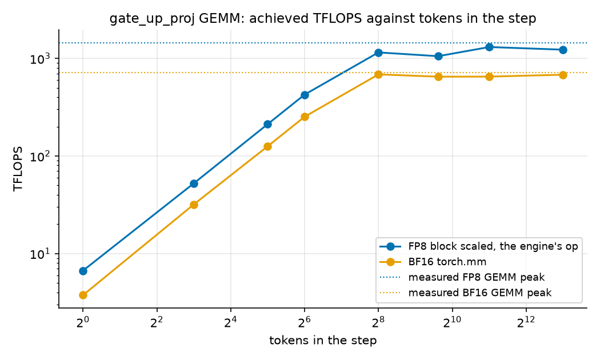

# Attention and Gated DeltaNet kernels of Qwen3.8-27B on an H200: shapes, warm caches and ragged batches

Measurements on one H200. vLLM 0.29 is the engine of record. Every number here comes from a file under `results/`, and every result row records the commit that produced it.

## 1. Methodology

### 1.1 Hardware and software

| Item | Value |
|---|---|
| GPU | 1x NVIDIA H200 141GB on Verda, compute capability 9.0, 132 SMs, driver 580.178.04, 700 W power limit |
| Engine | vLLM 0.29.0, CUDA 13 image, digest recorded in `results/env/environment.json` |
| Kernel libraries | the FlashInfer, Triton and vendored linear attention kernels shipped inside that image |
| Model | `Qwen/Qwen3.8-27B-FP8`, text path only (`--language-model-only`) |
| Where benchmarks run | inside the same container as the engine, so kernel versions are identical |

### 1.2 Ceilings

All utilization numbers are relative to ceilings I measured on this GPU. Memory bandwidth comes from copy and reduction kernels at 1, 4 and 16 GiB. BF16 and FP8 GEMM throughput comes from the model's largest projection shape. Vendor figures are listed next to them for reference only. I sample clocks and power during the ceiling runs and flag throttling.

### 1.3 Shape census

The census has three sources, and I check them against each other:

1. An analytic inventory from the model config. It follows vLLM's fused projection layout and counts how often each op runs per step (48 GDN layers, 16 attention layers, 64 MLPs). A second table gives the shapes under tensor parallel 1/2/4/8, fp8 KV, speculative decoding and prefix caching. Only the benchmarked configuration was measured; the other rows are marked analytic only.
2. Torch profiler traces of the live server. Eager mode shows the operator shapes. The default compiled mode shows the kernels that actually run in production.
3. The real mix of prefill tokens, decode tokens and sequences per engine step under load, at 1, 8, 32 and 128 clients, with prefix caching off and on.

The kernel sweeps use a grid. Section 2.5 checks that the grid covers the compositions the engine forms under load.

### 1.4 Regimes

| Regime | Definition |
|---|---|
| Cold | no cached tokens |
| Warm, fraction view | context L in multiples of 7840 tokens; cached fraction 0, 0.5, 0.9, 0.99 aligned to the 784 token manager block; only new tokens are computed over the cached KV |
| Warm, fixed new view | 64, 512, 2048 new tokens over cached history 0 to 125440 tokens (whole 784 token blocks) |
| Ragged prefill | fixed total new tokens (4096, 16384) over 8, 32, 128 sequences; lengths uniform, 80 to 100 percent jitter, lognormal (sigma 1.0), bimodal, mixed prefill plus decode; fixed seeds |
| Ragged decode | one new token per sequence; KV lengths uniform, jitter, lognormal, bimodal at equal total KV tokens |

On the H200 vLLM selects FlashAttention 3. It runs directly on the 784 token blocks, so that is the page size I measure. Pages of 16, 64 and 256 are measured as a comparison. For GDN the warm case passes a restored recurrent and conv state. The states come from a real prefill of 0, 1k and 64k tokens.

### 1.5 Timing and correctness

I time each point with CUDA events: 10 warmup calls, 50 timed repeats, one synchronize per batch of repeats, no L2 flush between repeats. I report the median with p10 and p90. If the spread is over 25 percent of the median I measure the point again with double repeats and flag it if it is still unstable. Every point is also captured into a CUDA graph and replayed. The tables show the replay median as kernel time. Eager time minus replay time is the launch overhead.

The numerics checks are GPU tests (`tests/test_gpu_attention_kernels.py`, `tests/test_gpu_gdn_kernels.py`). I ran them before the sweeps. They compare every backend with a plain PyTorch reference at a small shape. For GDN, a final state fed back as the initial state must reproduce the uninterrupted result.

I also checked how repeatable the sweeps are. I ran the cold attention, GDN decode and GDN cold sweeps a second time, on the same instance after a restart and from the final commit (`results/raw/repeat/`). Against the first rows the kernel times agree to 0.6 percent at the median and to 3 to 5 percent at the 90th percentile of points. The worst attention point differs by 11 percent. It is a 95 us decode kernel at batch 1 over 65k tokens, a small kernel that moves with the clocks. The Triton GDN kernels came out 2 to 7 percent faster in the second run, most likely a different autotuning result in a fresh process. The GDN decode kernels agree within 0.4 percent, the FlashInfer prefill kernels within 0.5 percent, and the attention kernels over 100 us within 4 percent.

### 1.6 Derived metrics

From the causal aware FLOPs and the bytes moved per call I derive achieved TFLOPS and GB/s, the share of the measured ceilings, microseconds per new token, and the per step cost (x16 for attention, x48 for GDN). Ragged efficiency is the achieved rate of a ragged batch relative to the uniform batch with the same total tokens. For GDN the work is linear in tokens, so this equals the uniform time divided by the ragged time. The crossover is the cached history length where one attention layer costs as much as one GDN layer at the same new token count.

### 1.7 Sum of parts

For each measured engine step, the predicted time is 48 x GDN + 16 x attention + supporting ops, all at the nearest benchmarked shapes. The difference to the measured step time is the residual. The sum is a bound, not a model of the engine. Kernel overlap and framework work are not in it.

## 2. Shape census

### 2.1 What the engine selected on this GPU

These values come from the vLLM startup log. The parsed record is `results/census/server_config.json`.

| Decision | Value |
|---|---|
| Attention backend | FLASH_ATTN, FlashAttention version 3 (candidates were FLASH_ATTN, FLASHINFER, TRITON_ATTN, FLEX_ATTENTION) |
| GDN prefill kernel | FlashInfer |
| GDN decode kernel for plain decode | Triton packed recurrent kernel. The log names a CUDA kernel, which the vLLM source only uses on speculative decoding batches; the eager trace shows only the Triton kernel in the decode steps |
| FP8 GEMM kernel | FlashInferFp8DeepGEMMDynamicBlockScaledKernel |
| KV manager block | 784 tokens, chosen so an attention page is at least as large as a GDN state page |
| Attention kernel page | 784 tokens. FlashAttention accepts any multiple of 16, so it runs directly on the manager block. FlashInfer would have run on a smaller kernel page |
| Prefix caching | on, mode align. GDN state is checkpointed only at block boundaries |
| Chunked prefill budget | 8192 tokens per step |
| KV cache capacity | 1400832 tokens |

The profiler trace (section 2.3) confirmed two consequences. A 1001 token prompt was scheduled as 784 + 217 tokens, because align mode chunks at block boundaries. And the GEMM kernels carry the fused shapes below, not the checkpoint tensor shapes.

### 2.2 Analytic operator inventory

I derived the inventory from the model config (`configs/qwen3.8-27b-fp8.config.json`) with vLLM's fused projection layout. The full table is `results/census/analytic_ops.md`; `results/census/analytic_ops.json` is the machine readable copy.

| | Value |
|---|---|
| Layers | 64: 48 GDN and 16 full attention, attention at layers 3, 7, 11, ..., 63 |
| Operator types | 28 (two added after the observed census, see 2.3) |
| GEMMs per GDN layer | `in_proj_qkvz` 5120 to 16384, `in_proj_ba` 5120 to 96 (BF16), `out_proj` 6144 to 5120 |
| GEMMs per attention layer | `qkv_proj` 5120 to 14336 (query with output gate, key, value), `o_proj` 6144 to 5120 |
| GEMMs per MLP | `gate_up_proj` 5120 to 34816, `down_proj` 17408 to 5120 |
| GDN state per sequence per layer | recurrent 3 MiB fp32, conv 60 KiB |
| KV cache per token | 64 KiB across the 16 attention layers |
| Language model weights | 29.5 GB predicted. The checkpoint is 30.9 GB including the vision tower (about 0.9 GB) and the speculative head (about 0.5 GB), so the match is within 0.2 percent |

The checkpoint stores the GDN projections as four tensors (qkv, z, a, b). vLLM fuses them into two GEMMs. A census built from tensor names would list five GEMMs per GDN layer at the wrong shapes.

### 2.3 Observed kernels, eager mode

I took one profiler trace of the live server in eager mode with shapes recorded. It covers a 1001 token prompt and seven decode steps. `bench.census.trace_parser` joins every GPU kernel to the operator that launched it, to the Python frames open at launch time, and to the engine step it ran in. `bench.census.diff` then matches the kernels to the inventory. GEMMs match by K and N from the recorded shapes, everything else by name and block. The outputs are `results/census/observed_ops.csv`, `observed_summary.md` and `census_diff.md`.

| step | kernel launches | distinct kernels | GPU kernel time |
|---|---:|---:|---:|
| prefill chunk of 784 tokens | 3415 | 61 | 63.1 ms |
| prefill chunk of 217 tokens | 3665 | 62 | 26.2 ms |
| decode, 1 sequence (mean of 7 steps) | 2668 | 46 | 11.6 ms |

Every kernel is explained, either by an inventory op or by engine work outside the model such as input preparation and sampling. That covers 100 percent of the kernel time in every step. The counts match the inventory: 64, 64, 16, 16, 48 and 48 launches for six of the seven projection GEMMs, 48 for the conv, 48 for the gated norm, 256 for the activation quantization. `in_proj_ba` shows 96 because cuBLAS runs it as a split K kernel plus a reduce. The trace also showed things the config alone does not:

- In eager mode each RMSNorm call is 13 small kernels. That is 1674 launches per step for 129 norms and 2.7 ms of the 11.6 ms decode step. The compiled mode fuses them.
- The q norm, k norm, rotary and output gate split run as one Triton kernel, not four ops.
- The FlashInfer chunked delta rule is four kernels per layer in prefill. The packed recurrent decode is one kernel.
- At M of 1 the FP8 GEMM is DeepGEMM's `swapAB` kernel, and the activation quantization runs inside the GEMM op. At M of 784 it is the `sm90_fp8_gemm_1d2d` kernel with a separate quantization kernel in front.
- The eager prefill path gathers the initial recurrent state of every sequence from the whole state pool (2052 slots) before the chunked kernel, and writes the final state back after it. Neither was in my inventory. I added `state_gather` and `state_checkpoint` after the diff flagged them.
- My inventory had the activation quantization at 304 per step, because it counted `in_proj_ba` as FP8. The trace shows 256, because that projection stays BF16. The inventory now says 256.

The eager decode step runs 2668 kernels for 11.6 ms of GPU time inside a step of about 119 ms. It is launch bound. That is why the engine serves decode from CUDA graphs.

### 2.4 Observed kernels, compiled mode

The same capture on the server in its default mode: torch.compile and CUDA graphs on, norm and quantization fusions enabled. I ran the grid in `configs/profile_grid.yaml` with `bench.census.profile_driver`: prefill of 128, 1024, 4096 and 16384 tokens at batch 1, 1024 tokens at batch 8, decode at batch 1, 8, 64 and 256 over 1k tokens, and batch 1 and 8 over 16k. One point is missing, the 64 sequence decode over 16k tokens. Its profiler export blocked the server for over 25 minutes and I dropped it. Kernels replayed from a graph carry no operator and no frames in the trace. The parser labels them by kernel name, and the GEMM shapes come from the template arguments in the DeepGEMM kernel names. Every kernel of the eleven traces is explained. The startup log is `results/census/server_startup_compiled.log`.

| step | mode | kernel launches | GPU kernel time | GEMMs | GDN | attention | norms | quantization |
|---|---|---:|---:|---:|---:|---:|---:|---:|
| decode, 1 sequence over 1k | eager | 2668 | 11.6 ms | 7.3 ms | 0.5 ms | 0.3 ms | 2.7 ms | 0.4 ms |
| decode, 1 sequence over 1k | compiled | 1107 | 9.1 ms | 7.4 ms | 0.5 ms | 0.3 ms | 0.4 ms | 0.4 ms |
| decode, 8 sequences over 1k | compiled | 1251 | 10.3 ms | 7.7 ms | 1.0 ms | 0.4 ms | 0.4 ms | 0.4 ms |
| decode, 64 sequences over 1k | compiled | 1251 | 16.2 ms | 7.7 ms | 5.2 ms | 1.3 ms | 0.4 ms | 0.9 ms |
| prefill chunk of 784 | eager | 3415 | 63.1 ms | 36.7 ms | 7.4 ms | 1.0 ms | 11.8 ms | 4.5 ms |
| prefill chunk of 784 | compiled | 1843 | 51.6 ms | 36.1 ms | 7.2 ms | 1.0 ms | 1.3 ms | 4.4 ms |
| prefill chunk of 3136 | compiled | 1843 | 169.1 ms | 113.1 ms | 20.3 ms | 6.9 ms | 4.6 ms | 18.3 ms |
| prefill chunk of 7840 | compiled | 1795 | 442.2 ms | 281.9 ms | 44.0 ms | 42.5 ms | 10.9 ms | 48.2 ms |
| mixed, 16 prefill sequences sharing 8064 tokens with 117 decodes | compiled | 2209 | 451.0 ms | 301.6 ms | 57.8 ms | 11.8 ms | 11.7 ms | 52.3 ms |

The GEMM column counts the DeepGEMM and cuBLAS kernels. The GDN and attention columns count the mixer kernels without their projections. The columns do not add up to the total; norms, activation, cache writes and engine work fill the rest. Three things stand out:

- Decode at batch 1 is 1107 launches from one CUDA graph and 9.1 ms of kernel time. The 129 norms went from 2.7 ms to 0.4 ms. The GEMMs are 7.4 ms of the 9.1 ms. They move 26.9 GB of weights at 3.6 TB/s, 85 percent of the copy ceiling. The roofline for this step is 6.4 ms (section 7), so the step runs at 70 percent of its roofline on kernel time alone.
- GEMM time is flat from batch 1 to batch 64 (7.4, 7.7, 7.7 ms). The decode GEMMs stream weights, and extra rows are free. GDN grows from 0.5 to 5.2 ms, one state per sequence, and attention from 0.3 to 1.3 ms.
- The per token quantization is a real cost in prefill: 4.4 ms of the 51.6 ms chunk of 784, and 48 ms of the 442 ms chunk of 7840, about 10 percent. The GEMMs it feeds are 65 percent of the chunk. The GDN kernels are 14 percent of the 784 chunk and 10 percent of the 7840 chunk. Attention grows from 2 to 10 percent between the two.

### 2.5 What a step looks like under load

The third source is the engine under a closed loop load. `bench.census.step_distribution` runs a fixed number of clients against the server. Each client sends a completion with a prompt of lognormal length (mean 1024 tokens, sigma 0.8, clipped to 64 to 8192) and 128 output tokens. Once the loop is in steady state, the profiler runs for a few seconds. vLLM annotates every step with the prefill sequences, the prefill tokens and the decode sequences it scheduled, so the composition and the duration of each step come straight out of the trace. With prefix caching on, half the prompts start with the same 2352 token prefix so the cache gets hits. The rows are in `results/census/step_distribution.csv`.

| caching | clients | steps in the window | pure decode | mixed | pure prefill | prefill tokens per step p50 / max | decode sequences per step | step time p50 |
|---|---:|---:|---:|---:|---:|---|---:|---:|
| on | 1 | 531 | 527 | 0 | 4 | 627 / 723 | 1 | 9.7 ms |
| on | 8 | 383 | 372 | 11 | 0 | 1069 / 3879 | 8 | 10.9 ms |
| on | 32 | 257 | 247 | 10 | 0 | 2691 / 7738 | 32 | 14.1 ms |
| on | 128 | 75 | 68 | 7 | 0 | 7849 / 8086 | 128 | 24.4 ms |
| off | 1 | 538 | 534 | 0 | 4 | 627 / 723 | 1 | 9.6 ms |
| off | 8 | 398 | 389 | 6 | 3 | 2428 / 7111 | 8 | 10.8 ms |
| off | 32 | 131 | 123 | 8 | 0 | 7946 / 8182 | 32 | 13.9 ms |
| off | 128 | 99 | 95 | 4 | 0 | 8087 / 8094 | 128 | 24.9 ms |

With 128 output tokens per request, over 90 percent of the steps are pure decode at every concurrency. The step time is the cost of the decode batch: 9.7 ms for one sequence, 10.9 for 8, 14.1 for 32 and 24.4 for 128. Caching off gives the same within 2 percent. This matches section 2.4, where the decode GEMMs cost the same at batch 1 and 64 and only GDN and attention grow.

Prefill arrives in mixed steps, and that is where caching shows. With caching off a prompt is prefilled in full. At 32 and 128 clients the mixed steps carry chunks that fill the 8192 token budget and take 340 to 460 ms. With caching on, half the prompts start with a cached prefix. At 8 and 32 clients the mixed steps carry 1k to 3k tokens and take about 180 ms. At 128 clients the budget is full either way. A mixed step delays every decode in the batch, so at 32 clients the cache halves the typical mixed step a decode waits behind. The sweeps of sections 4 and 5 cover these compositions: decode batches of 1 to 256 over 1k to 4k tokens of KV, and prefill chunks from a few hundred to 8k tokens.

## 3. Ceilings

I measured the ceilings with `bench.core.ceilings` and recorded them in `results/env/ceilings.json`. A ceiling is the best burst observed. The sustained rate stands next to it.

| Ceiling | Measured | Vendor figure |
|---|---|---|
| HBM bandwidth | 4277 GB/s (device copy, 4 GiB) | 4800 GB/s |
| BF16 GEMM | 716 TFLOPS peak, 673 sustained | 989 TFLOPS dense |
| FP8 GEMM | 1452 TFLOPS peak | 1979 TFLOPS dense |

The GEMM shape is 16384 x 5120 x 34816, the model's largest projection. The FP8 number comes from `torch._scaled_mm` with a per tensor scale. That is not the block scaled kernel the model uses, but it is the ceiling, and the block scaled GEMMs are measured against it. Read bandwidth from a reduction reaches 3578 GB/s, less than the copy, so the copy sets the ceiling.

Under sustained load the GPU sits at its 700 W power cap (693 W drawn) and the SM clock drops to 73 percent of its maximum. This is power capping, not thermal throttling; the driver reports no slowdown event. Every sustained number here is taken in that state. A serving engine runs in the same state.

## 4. Attention results

The kernel is FlashAttention 3 from vLLM's own build, with a paged KV cache of 784 token pages, 24 query heads over 4 KV heads and head dim 256. Kernel times are GPU time from CUDA graph replay. The eager call adds 20 to 30 us of host time at small shapes (section 4.1) and nothing measurable at large ones. The model has 16 attention layers per step. Raw rows are in `results/raw/attention_*.jsonl`.

### 4.1 Cold prefill

Nothing is cached, so every query attends causally over its own sequence.

| tokens per sequence | batch | kernel us | us per token | TFLOPS (share of BF16 ceiling) |
|---:|---:|---:|---:|---:|
| 128 | 1 | 15 | 0.120 | 13 (2%) |
| 128 | 16 | 36 | 0.018 | 89 (12%) |
| 512 | 1 | 45 | 0.088 | 72 (10%) |
| 512 | 16 | 192 | 0.023 | 269 (38%) |
| 1024 | 1 | 34 | 0.034 | 376 (52%) |
| 1024 | 16 | 449 | 0.027 | 459 (64%) |
| 4096 | 1 | 350 | 0.086 | 589 (82%) |
| 4096 | 16 | 5882 | 0.090 | 561 (78%) |
| 16384 | 1 | 5159 | 0.315 | 639 (89%) |
| 16384 | 16 | 84366 | 0.322 | 626 (87%) |
| 65536 | 1 | 82265 | 1.255 | 642 (90%) |

Attention becomes compute bound quickly. From 1k tokens the kernel runs above half of the BF16 GEMM ceiling. From 16k tokens it is near 90 percent. The cost per token grows with the sequence length, because each token attends over everything before it.

Below about 1k tokens at batch 1 the eager call costs 45 to 52 us whatever the size. The GPU time from graph replay is 15 to 45 us. So a third to two thirds of the eager time is host work, the Python wrapper and the launch of `flash_attn_varlen_func`. The scheduler metadata is computed once outside the timed call, as vLLM does per step. A 64 or 128 token chunk of a warm prefill lands in this regime. The 512 token point measured 45 us against 34 us for 1024 tokens. I keep the row as measured and treat it as an outlier of the replay measurement.

### 4.2 Decode

Each sequence produces one new token that attends over its full KV history. The KV of every sequence is read once, so decode is bound by KV bandwidth.

| KV tokens per sequence | batch | kernel us | KV GB/s (share of HBM ceiling) | 16 layers, ms |
|---:|---:|---:|---:|---:|
| 1024 | 1 | 17.3 | 243 (6%) | 0.28 |
| 1024 | 64 | 76.8 | 3514 (82%) | 1.23 |
| 1024 | 256 | 279.3 | 3867 (90%) | 4.47 |
| 4096 | 1 | 19.2 | 874 (20%) | 0.31 |
| 4096 | 64 | 262.5 | 4096 (96%) | 4.20 |
| 4096 | 256 | 1074.0 | 4005 (94%) | 17.18 |
| 16384 | 1 | 38.7 | 1735 (41%) | 0.62 |
| 16384 | 64 | 1063.5 | 4040 (94%) | 17.02 |
| 16384 | 256 | 4305.6 | 3992 (93%) | 68.89 |
| 65536 | 1 | 95.1 | 2823 (66%) | 1.52 |
| 65536 | 64 | 4191.3 | 4099 (96%) | 67.06 |
| 65536 | 256 | 17020.4 | 4038 (94%) | 272.33 |
| 131072 | 1 | 149.2 | 3599 (84%) | 2.39 |
| 131072 | 64 | 8362.6 | 4109 (96%) | 133.80 |
| 131072 | 256 | 34576.0 | 3975 (93%) | 553.22 |

At small batch the kernel cannot fill the GPU and bandwidth is low. From batch 64 at 4k tokens up it runs at 93 to 96 percent of the copy ceiling. One point (16k tokens, batch 16) reaches 4323 GB/s, 1 percent above the ceiling. Decode is almost pure reading, and a read only stream can beat a copy, so the copy figure is a reference here, not a hard bound. Attention decode cost grows with the context. GDN decode cost does not (section 5.1). At batch 64, attention over 131k tokens costs 8.4 ms per layer, a GDN layer 0.11 ms.

### 4.3 Warm cache

Prefix caching keeps the KV of the cached prefix and computes only the new tokens. The new tokens still attend over the whole context. The first view is the fraction view at batch 8: a context of L tokens with 0, 50, 90 or 99 percent already cached, rounded down to whole 784 token blocks.

| context | cached fraction | cached | new | kernel us | us per new token |
|---:|---:|---:|---:|---:|---:|
| 7840 | 0 | 0 | 7840 | 9944 | 0.159 |
| 7840 | 0.5 | 3920 | 3920 | 7423 | 0.237 |
| 7840 | 0.9 | 7056 | 784 | 1900 | 0.303 |
| 15680 | 0 | 0 | 15680 | 38712 | 0.309 |
| 15680 | 0.5 | 7840 | 7840 | 28805 | 0.459 |
| 15680 | 0.9 | 14112 | 1568 | 7593 | 0.605 |
| 15680 | 0.99 | 14896 | 784 | 3782 | 0.603 |
| 31360 | 0 | 0 | 31360 | 153844 | 0.613 |
| 31360 | 0.9 | 28224 | 3136 | 30212 | 1.204 |
| 31360 | 0.99 | 30576 | 784 | 7833 | 1.249 |
| 62720 | 0 | 0 | 62720 | 619332 | 1.234 |
| 62720 | 0.9 | 56448 | 6272 | 117778 | 2.347 |
| 62720 | 0.99 | 61936 | 784 | 15614 | 2.490 |
| 125440 | 0 | 0 | 125440 | 2467286 (eager) | 2.459 |
| 125440 | 0.9 | 112896 | 12544 | 472837 | 4.712 |
| 125440 | 0.99 | 123872 | 1568 | 62870 | 5.012 |

A 90 percent warm cache cuts the attention time of a 7840 token context by 5.2x, not 10x. The 784 new tokens each attend over all 7840 tokens. In a cold prefill the average token attends over half the context, so the cost per new token is twice as high in the warm case. The same effect makes the kernel slower per new token at 125k than at 7k. The value marked eager is an eager median; that point's graph capture hit the point timeout.

The second view keeps the new tokens fixed. The crossover in section 6 uses it. The table gives kernel us for 64, 512 and 2048 new tokens per sequence over a cached history. The last column is the GDN kernel at the same new tokens and batch (FlashInfer, restored state).

| new tokens | batch | cached 0 | 1568 | 7840 | 15680 | 31360 | 62720 | 125440 | GDN layer |
|---:|---:|---:|---:|---:|---:|---:|---:|---:|---:|
| 64 | 1 | 16 | 24 | 38 | 70 | 115 | 190 | 352 | 61 |
| 64 | 8 | 16 | 81 | 214 | 430 | 781 | 1593 | 3172 | 92 |
| 64 | 32 | 35 | 153 | 692 | 1356 | 2711 | 5356 | 10806 | 309 |
| 512 | 1 | 62 | 80 | 236 | 410 | 765 | 1562 | 2978 | 121 |
| 512 | 8 | 110 | 316 | 1347 | 2762 | 5327 | 10512 | 21116 | 266 |
| 512 | 32 | 382 | 1339 | 5496 | 10763 | 21665 | 42508 | 83272 | 995 |
| 2048 | 1 | 134 | 242 | 748 | 1377 | 2792 | 5439 | 10498 | 209 |
| 2048 | 8 | 811 | 1825 | 6071 | 11330 | 21525 | 41886 | 82960 | 853 |
| 2048 | 32 | 3237 | 7193 | 23572 | 43861 | 84380 | 166378 | 330375 | 3670 |

Time is linear in the cached length from about 8k on. The surprise for me was the bound. At 512 new tokens and batch 8 the kernel runs at 81 to 84 percent of the BF16 GEMM ceiling for every cached length from 1.5k to 125k. Warm attention with a few hundred new tokens is compute bound, not KV bandwidth bound. With 24 query heads over 4 KV heads and 512 queries, every KV element loaded serves 3072 query rows. Only the one token decode case (section 4.2) is bandwidth bound. Prefix caching saves the prefill of the cached tokens. The new tokens still pay the full attention over them.

Seven fraction view points had calls of 1.9 to 10 seconds: five at batch 32 with contexts of 62720 and 125440 tokens, two at batch 8. Two were recorded as timeouts. The other five kept their eager median, because the timeout hit during graph capture and the capture fallback swallowed it. The timer now synchronizes per call for calls over 100 ms, so this cannot happen again. The warm sweeps ran before that fix. The fixed new token view covers the same cached lengths, so nothing is missing for the crossover.

### 4.4 Ragged batches

Attention work grows with the square of a sequence's length. A batch with one long sequence has more real work than a uniform batch with the same total tokens. So I compare the achieved rate in causal aware TFLOPS, not the time. The batches have 16384 new tokens over 8, 32 and 128 sequences, with lengths drawn from a fixed seed.

| sequences | distribution | length cv | max / mean length | kernel us | TFLOPS |
|---:|---|---:|---:|---:|---:|
| 8 | uniform | 0 | 1.0 | 684 | 603 |
| 8 | jitter | 0.05 | 1.1 | 788 | 525 |
| 8 | lognormal | 0.58 | 1.8 | 1016 | 545 |
| 8 | bimodal | 1.13 | 4.0 | 1626 | 580 |
| 32 | uniform | 0 | 1.0 | 388 | 266 |
| 32 | jitter | 0.06 | 1.1 | 330 | 314 |
| 32 | lognormal | 0.91 | 4.6 | 435 | 433 |
| 32 | bimodal | 2.69 | 16.0 | 1533 | 556 |
| 128 | uniform | 0 | 1.0 | 199 | 130 |
| 128 | jitter | 0.06 | 1.1 | 218 | 120 |
| 128 | lognormal | 1.41 | 10.7 | 292 | 265 |
| 128 | bimodal | 5.59 | 64.0 | 1478 | 562 |

Raggedness itself costs FlashAttention little. At 8 sequences the rate stays within 13 percent of the uniform batch for every mix. What moves the rate is the length of the individual sequences. 128 uniform sequences of 128 tokens run at 130 TFLOPS, because a 128 token sequence has little work per KV byte. The bimodal batch with the same 128 sequences runs at 562 TFLOPS, because one 8k sequence carries most of the work. A ragged batch with a few long sequences is a good batch for attention. A uniform batch of short ones is not. The mixed distribution puts half the sequences as single decode tokens over a 16k history. That adds KV reading the FLOP rate does not see, so I list it separately: 1466 us at 8 sequences, 718 at 32, 1385 at 128.

Ragged decode runs one new token per sequence over KV lengths with a mean of 16384.

| sequences | distribution | length cv | kernel us | KV GB/s |
|---:|---|---:|---:|---:|
| 16 | uniform | 0 | 248 | 4328 |
| 16 | jitter | 0.05 | 390 | 2753 |
| 16 | lognormal | 0.73 | 356 | 3020 |
| 16 | bimodal | 1.81 | 288 | 3725 |
| 64 | uniform | 0 | 1146 | 3751 |
| 64 | jitter | 0.06 | 1077 | 3989 |
| 64 | lognormal | 1.30 | 1413 | 3041 |
| 64 | bimodal | 3.91 | 1138 | 3774 |
| 256 | uniform | 0 | 4222 | 4071 |
| 256 | jitter | 0.07 | 4284 | 4012 |
| 256 | lognormal | 1.28 | 5152 | 3336 |
| 256 | bimodal | 7.95 | 4301 | 3995 |

Here the total work is the same, because the KV of every sequence is read once, so time is the right comparison. A lognormal mix of KV lengths costs 22 to 23 percent over uniform at 64 and 256 sequences. Bimodal costs almost nothing. At 16 sequences the picture is noisier: a 5 percent jitter is 57 percent slower than uniform. I think this is FlashAttention's split of long KV across CTAs. The trace shows its combine kernel, and the split count comes from the scheduler metadata, which sees the batch and the longest sequence. At 16 sequences that choice is on a knife edge. I have not confirmed this on the kernel side. GDN decode has no such dependence, because its state is the same size for every sequence (section 5.1).

### 4.5 Page size

vLLM's manager block is 784 tokens on this GPU and FlashAttention 3 runs directly on it. Would a smaller page matter? The sweep runs 512 new tokens over 1568, 15680 and 62720 cached tokens, and decode over 16384 tokens at batch 64.

| point | page 16 | page 64 | page 256 | page 784 |
|---|---:|---:|---:|---:|
| 512 new over 1568 cached, batch 1 | 79 | 105 | 93 | 91 |
| 512 new over 1568 cached, batch 8 | 314 | 350 | 331 | 352 |
| 512 new over 15680 cached, batch 1 | 395 | 405 | 416 | 423 |
| 512 new over 15680 cached, batch 8 | 2593 | 2645 | 2663 | 2646 |
| 512 new over 62720 cached, batch 1 | 1506 | 1495 | 1493 | 1493 |
| 512 new over 62720 cached, batch 8 | 10130 | 10163 | 10250 | 10245 |
| decode, 16384 KV, batch 64 | 1062 | 1066 | 1086 | 1065 |

From 15680 cached on the pages are within a few percent of each other, and within noise for the long contexts. At 1568 cached the kernel is so short (79 to 105 us at batch 1) that the spread is launch geometry, not page size; there is no trend across pages. The page size is a memory management decision here, not a kernel performance one. On a GPU where vLLM picks FlashInfer and a smaller page, this table says that costs nothing.

## 5. GDN results

All kernel times in this section are GPU time from CUDA graph replay. Eager time minus graph time is the launch overhead. Raw rows are in `results/raw/gdn_*.jsonl`, tidy tables in `results/processed/`. The model has 48 GDN layers per step.

### 5.1 Decode

This is the packed recurrent kernel, the engine's plain decode path, with the causal conv update in front. The state is 3.2 MB per sequence per layer (3 MiB recurrent plus 60 KiB conv). It is read and written once per step, so decode is bound by state bandwidth.

| batch | kernel us | launch us | state GB/s (share of ceiling) | 48 layers, ms | sigmoid gating variant us |
|---:|---:|---:|---:|---:|---:|
| 1 | 9.8 | 60 | 661 (15%) | 0.47 | 9.6 |
| 16 | 34.1 | 43 | 3038 (71%) | 1.64 | 45.0 |
| 64 | 113.2 | 1 | 3656 (85%) | 5.44 | 125.2 |
| 256 | 421.8 | 1 | 3925 (92%) | 20.25 | 440.0 |
| 1024 | 1656.7 | 1 | 3998 (93%) | 79.52 | 1707.9 |

At batch 1024 the kernel moves 6.6 GB in 1.66 ms, 93 percent of the HBM ceiling. At batch 1 the kernel is 9.8 us but the launch costs 60 us. The engine hides that only while the GPU is busy with other work.

Decode time does not depend on how the state was produced. At batch 64 the kernel takes 113 us with fresh states, 123 us after a 1024 token history and 113 us after a 65536 token history.

### 5.2 Cold prefill

This is the conv, the gating and the chunked gated delta rule for a single sequence at batch 1.

| tokens | FlashInfer kernel us | us per token | launch us | Triton kernel us |
|---:|---:|---:|---:|---:|
| 128 | 66 | 0.512 | 338 | 59 |
| 512 | 121 | 0.237 | 283 | 118 |
| 1024 | 137 | 0.134 | 272 | 196 |
| 4096 | 347 | 0.085 | 66 | 697 |
| 16384 | 1186 | 0.072 | 20 | 2659 |
| 65536 | 4874 | 0.074 | 15 | 11251 |

From 4k tokens up the kernel settles at about 0.07 us per token per layer. The 48 GDN layers then cost about 57 ms for a 16k token prefill. Below 1k tokens the fixed cost dominates. FlashInfer is faster than Triton at every length past 512 tokens.

### 5.3 Warm state

This sweep prefills a fixed number of new tokens on top of a restored state. The states come from a real prefill of 0, 1024 and 65536 tokens, so history independence is measured, not assumed. FlashInfer kernel, batch 8, kernel us:

| new tokens | history 0 | history 1024 | history 65536 |
|---:|---:|---:|---:|
| 64 | 92 | 92 | 92 |
| 512 | 266 | 266 | 265 |
| 2048 | 851 | 853 | 851 |

The columns are equal within noise. The state has a fixed size, so loading it costs the same whatever history produced it. The hybrid design relies on this, and the kernel the engine runs delivers it.

### 5.4 Ragged batches

This sweep spreads 16384 new tokens over 32 sequences, with lengths from five distributions and a fixed seed. Efficiency is the achieved rate relative to the uniform batch. GDN work is linear in tokens, so this equals the uniform time divided by the ragged time.

| distribution | length cv | FlashInfer us | efficiency | Triton us | efficiency |
|---|---:|---:|---:|---:|---:|
| uniform | 0.00 | 994 | 1.00 | 2529 | 1.00 |
| jitter | 0.06 | 1009 | 0.99 | 2582 | 0.98 |
| lognormal | 0.91 | 1010 | 0.98 | 2583 | 0.98 |
| bimodal | 2.69 | 1024 | 0.97 | 2635 | 0.96 |
| mixed | 1.00 | 1009 | 0.99 | 2579 | 0.98 |

The chunked kernels lose at most a few percent to raggedness here. That includes the mixed case, where half the sequences are single decode tokens. The worst case in the whole sweep is 12 percent, for the Triton kernel with 4096 tokens over 32 sequences in the bimodal mix. Work is scheduled in fixed token chunks along the concatenated sequence (64 tokens in the Triton kernel; I have not checked the FlashInfer chunk size). The length mix hardly matters as long as the total is the same.

### 5.5 Two kernel limits found on the way

In my first runs both chunked kernels faulted with an illegal memory access on very large single calls, FlashInfer at 501760 tokens and Triton at 250880. The engine caps a prefill step at 8192 tokens on this GPU, so this cannot happen in serving. The benchmark now refuses calls above 131072 tokens and records them as unsupported. Those are the four unsupported rows in the results.

## 6. Attention versus GDN

In the warm sweeps both mixers computed the same new tokens at the same batch. GDN time does not depend on the history. Attention time grows with it. `analysis.crossover` finds the cached length where one attention layer costs as much as one GDN layer, by linear interpolation between measured points. It also finds where the whole step crosses, with 16 attention layers against 48 GDN layers. The output is `results/processed/crossover.md`.

| new tokens | batch | GDN layer us | attention layer us at 0 cached | at 125k cached | layer crossover, cached tokens | step crossover, cached tokens | attention share of mixer time at 125k |
|---:|---:|---:|---:|---:|---:|---:|---:|
| 64 | 1 | 61 | 16 | 352 | 13490 | 60314 | 66% |
| 64 | 8 | 92 | 16 | 3172 | 2109 | 10135 | 92% |
| 64 | 32 | 309 | 35 | 10806 | 3384 | 10626 | 92% |
| 512 | 1 | 121 | 62 | 2978 | 3209 | 13544 | 89% |
| 512 | 8 | 266 | 110 | 21116 | 1182 | 4490 | 96% |
| 512 | 32 | 995 | 382 | 83272 | 1004 | 4049 | 97% |
| 2048 | 1 | 209 | 134 | 10498 | 1097 | 6346 | 94% |
| 2048 | 8 | 853 | 811 | 82960 | 64 | 2650 | 97% |
| 2048 | 32 | 3670 | 3237 | 330375 | 171 | 3030 | 97% |

With nothing cached, an attention layer is cheaper than a GDN layer at every shape I measured. The chunked GDN kernel has a high fixed cost and runs far from its roofline (section 7). FlashAttention on a short sequence is a small, efficient kernel. The picture flips quickly with history. At 512 new tokens and batch 8, one attention layer passes one GDN layer at about 1.2k cached tokens. The 16 attention layers pass the 48 GDN layers at about 4.5k. At 16k cached tokens attention is 60 to 80 percent of the mixer time for batch 8 and 32. At 62k it is 85 to 94 percent. At 125k it is over 90 percent in every configuration with batch 8 or more.

The case I care about most is 90 percent of the pages warm. For a chunk of 784 new tokens over 7056 cached, the 16 attention layers cost the same as the 48 GDN layers at batch 1 (6.0 ms each). At batch 8 they cost 1.7x as much (30.4 against 18.0 ms).

Decode tells the same story with the numbers from sections 4.2 and 5.1. At batch 64, one attention layer over 4k tokens (263 us) costs as much as 2.3 GDN layers (113 us). Over 131k tokens (8.4 ms) it costs as much as 74 of them. Three quarters of the layers have a fixed size state. The quarter with a KV cache sets the cost once contexts are long.

## 7. Roofline model

What should the roofline be? `analysis.perf_model` answers that per operator and per step. Every operator gets its FLOPs and the bytes it must move, from the model geometry and the step composition (new and cached tokens per sequence). Its roofline time is the larger of the compute time at the measured GEMM ceiling and the memory time at the measured copy bandwidth. The step time is the sum over all layers. Nothing is fitted to the measurements; the numbers are lower bounds for a serial engine. A step composition is written as groups of `COUNTx(NEW+CACHED)`, so `64x(1+4096)` is decode at batch 64 over 4k tokens.

| scenario | new tokens | sequences | MLP ms | attention ms | GDN ms | LM head ms | norms, quant, embedding ms | total ms | memory bound share |
|---|---:|---:|---:|---:|---:|---:|---:|---:|---:|
| cold prefill chunk 8192 | 8192 | 1 | 205.9 | 39.8 | 75.5 | 0.6 | 25.0 | 346.9 | 16% |
| warm chunk 784 over 7056 | 784 | 1 | 19.7 | 5.3 | 7.3 | 0.6 | 2.4 | 35.3 | 16% |
| decode batch 1 at 4k | 1 | 1 | 4.0 | 0.5 | 1.4 | 0.6 | 0.0 | 6.4 | 100% |
| decode batch 64 at 4k | 64 | 64 | 4.2 | 4.4 | 6.1 | 0.6 | 0.2 | 15.5 | 100% |
| decode batch 64 at 64k | 64 | 64 | 4.2 | 64.7 | 6.1 | 0.6 | 0.2 | 75.8 | 100% |
| decode batch 256 at 16k | 256 | 256 | 6.4 | 65.0 | 20.8 | 0.9 | 0.8 | 93.9 | 90% |
| mixed: one chunk of 4096 with 32 decodes at 16k | 4128 | 33 | 103.7 | 19.3 | 40.4 | 0.6 | 12.6 | 176.6 | 22% |

The attention and GDN columns include their projections. The model says three things before anything is measured. A batch 1 decode step cannot be faster than 6.4 ms on this GPU, because the weights alone take that long to stream; the LM head is 0.6 ms of it. A cold 8k chunk is a GEMM problem, and the attention kernel is 5 percent of it. By 64k of context at batch 64, reading the KV for attention is 85 percent of the step even at the roofline. The per op tables are in `results/processed/perf_model.json`.

The same roofline applied to every measured kernel point gives its attainment, the roofline time divided by the measured time.

| kernel | backend | points | median attainment | min | max |
|---|---|---:|---:|---:|---:|
| attention cold | FlashAttention 3 | 36 | 84% | 6% | 101% |
| attention warm | FlashAttention 3 | 121 | 84% | 3% | 89% |
| attention ragged | FlashAttention 3 | 42 | 71% | 22% | 101% |
| attention pages | FlashAttention 3 | 28 | 78% | 30% | 95% |
| GDN decode | packed recurrent | 7 | 85% | 15% | 93% |
| GDN decode | sigmoid gating variant | 7 | 77% | 16% | 91% |
| GDN prefill, cold | FlashInfer | 15 | 17% | 4% | 24% |
| GDN prefill, cold | Triton | 15 | 8% | 4% | 9% |
| GDN prefill, warm | FlashInfer | 58 | 20% | 4% | 25% |
| GDN prefill, ragged | FlashInfer | 30 | 20% | 14% | 25% |

Attention and the GDN decode kernel sit near the line. They cost what the hardware says they should. The low points are small shapes that cannot fill 132 SMs. The chunked GDN prefill kernels do not sit near the line. At batch 1 the FlashInfer kernel is about 6 times its roofline from 4k tokens up (5.8 to 6.7x). The Triton kernel is 13 to 14 times. Below 4k it is worse: 10x at 1k and 28x at 128 tokens, where the fixed cost dominates.

Part of that gap is the algorithm, not the kernel. The roofline counts the minimum of the recurrence, 8 flops per token per value head per head dimension squared, with the state kept on chip. The chunked algorithm writes a 3 MiB state per 64 token chunk and reads it back. For a 16k prefill that is about 1.6 GB, worth 380 us of bandwidth at the ceiling. It also does intra chunk attention and a triangular solve. Even against that more generous bound the kernel reaches about half. This is the largest gap between measured and possible in the whole model. It is also the main reason the GDN layers are not cheaper than attention at short contexts.

## 8. Supporting ops

The mixers are a small part of a step. The projections and the elementwise ops around them are the rest. `bench.ops.run` times them at token counts from 1 to 8192, with the same clock as the kernel sweeps. The FP8 projections go through the op the engine calls, `dynamic_flashinfer_deepgemm_blockscale_gemm`. It quantizes the BF16 activation per 128 token group inside, and it dispatches to FlashInfer's swapAB kernel below 32 rows and to DeepGEMM above. The BF16 path is a plain `torch.mm` for comparison. Norms, activation, quantization and rotary are the vLLM custom ops. Raw rows are in `results/raw/ops_*.jsonl`.

### 8.1 Projections

Kernel us per call, for the engine path (FP8 block scaled, or BF16 where the model keeps BF16) and for a BF16 torch.mm of the same shape:

| projection | path | 1 | 8 | 32 | 64 | 256 | 784 | 2048 | 8192 |
|---|---|---:|---:|---:|---:|---:|---:|---:|---:|
| gate_up_proj 5120 to 34816 | engine | 53 | 54 | 54 | 54 | 79 | 265 | 558 | 2378 |
| gate_up_proj | bf16 | 95 | 89 | 91 | 90 | 133 | 430 | 1123 | 4293 |
| down_proj 17408 to 5120 | engine | 32 | 32 | 36 | 34 | 59 | 183 | 386 | 1439 |
| down_proj | bf16 | 52 | 52 | 50 | 53 | 77 | 202 | 557 | 2186 |
| in_proj_qkvz 5120 to 16384 | engine | 27 | 27 | 29 | 29 | 42 | 130 | 276 | 1182 |
| in_proj_qkvz | bf16 | 44 | 43 | 44 | 45 | 62 | 178 | 493 | 2058 |
| qkv_proj 5120 to 14336 | engine | 25 | 25 | 27 | 27 | 46 | 114 | 235 | 1048 |
| qkv_proj | bf16 | 45 | 44 | 42 | 40 | 60 | 154 | 447 | 1743 |
| out_proj 6144 to 5120 | engine | 16 | 15 | 15 | 14 | 25 | 72 | 145 | 508 |
| out_proj | bf16 | 22 | 22 | 21 | 21 | 32 | 77 | 176 | 784 |
| o_proj 6144 to 5120 | engine | 15 | 15 | 16 | 14 | 24 | 70 | 145 | 486 |
| o_proj | bf16 | 23 | 23 | 22 | 21 | 31 | 76 | 165 | 747 |
| in_proj_ba 5120 to 96, BF16 in the model | engine | 9 | 9 | 9 | 9 | 10 | 12 | 11 | 27 |
| lm_head 5120 to 248320, BF16 in the model | engine | 563 | 562 | 574 | 571 | 1030 | 2962 | 7657 | not run |

Up to 64 rows the time does not move. The projection streams its weights and the rows ride along. The FP8 path moves the 178 MB of gate_up_proj weights in 53 us, 3.3 TB/s or 78 percent of the copy ceiling. The smaller projections do worse: 2.0 TB/s for the 31 MB of out_proj. The BF16 path takes about twice as long, because it reads twice the bytes.

From 784 rows on the FP8 GEMMs are compute bound: 1050 TFLOPS for gate_up_proj at 784 rows, 1230 to 1310 at 2048 and 8192 rows, 73 to 90 percent of the FP8 ceiling. The two small output projections lag at 690 TFLOPS for 784 rows, because N of 5120 gives the kernel too few tiles. The BF16 GEMMs reach 90 to 110 percent of the BF16 ceiling at these sizes; the ceiling is one shape, so some points sit above it. The LM head is 2.5 GB of BF16 weights. It costs 0.56 ms per step whatever the batch and 7.7 ms at 2048 rows. The sweep does not run it at 8192 rows, because the engine only computes logits for the last token of each sequence.

### 8.2 Elementwise ops

Kernel us per call for the engine's kernels, with the bandwidth reached at 8192 tokens:

| op | 1 | 8 | 32 | 64 | 256 | 784 | 2048 | 8192 | GB/s at 8192 (share of copy ceiling) |
|---|---:|---:|---:|---:|---:|---:|---:|---:|---:|
| fused_add_rms_norm 5120 | 8 | 8 | 8 | 8 | 8 | 9 | 19 | 86 | 3898 (91%) |
| rms_norm 5120 | 8 | 7 | 8 | 8 | 8 | 8 | 12 | 49 | 3408 (80%) |
| silu_and_mul 34816 to 17408 | 8 | 8 | 8 | 8 | 11 | 27 | 61 | 220 | 3882 (91%) |
| per token group quant, 5120 wide | 8 | 8 | 8 | 8 | 8 | 12 | 26 | 95 | 1337 (31%) |
| per token group quant, 17408 wide | 8 | 8 | 8 | 8 | 13 | 33 | 82 | 311 | 1389 (32%) |
| per token group quant, 6144 wide | 8 | 8 | 8 | 8 | 8 | 14 | 31 | 113 | 1349 (32%) |
| rotary, 28 heads, 64 of 256 dims | 7 | 7 | 8 | 8 | 8 | 8 | 11 | 31 | 1917 (45%) |

Everything under 10 us here is the measurement floor, not the kernel. A CUDA graph replay of a one element add takes 7.8 us on this GPU (`results/env/launch_floor.json`), and the compiled trace shows the fused norm at 3.4 us inside the engine's graph. The norms and the activation reach 80 to 91 percent of the copy ceiling once there are a few thousand tokens. The per token quantization does not. It runs at 31 to 32 percent of the ceiling at every width, three times slower than the norm that reads the same tensor. It runs 256 times per prefill step, and the compiled census puts it at 10 percent of a prefill chunk (section 2.4). In decode it disappears inside the GEMM op.

### 8.3 What a step spends outside the mixers

The engine path summed over one step at the measured token counts, with each op counted as often as the model runs it:

| tokens in the step | projections and LM head | norms, activation, quantization, rotary | total supporting ops |
|---:|---:|---:|---:|
| 1 | 9.2 ms | 3.6 ms at the floor, about 1.0 ms in the engine's graph | 9.2 to 12.7 ms |
| 64 | 9.4 ms | 3.6 ms at the floor | 9.4 to 13.0 ms |
| 784 | 44.8 ms | 7.6 ms | 52.4 ms |
| 8192 | 351.2 ms without the LM head | 65.0 ms | 416 ms |

At batch 1 the projections alone are 9.2 ms, against a 6.4 ms roofline for the whole step. The compiled trace shows the same work at 7.4 ms inside the engine's graph (section 2.4), without the per call floor. The elementwise ops matter at prefill sizes: 65 ms of a 416 ms 8k chunk, most of it the quantization.

## 9. Sum of parts against measured step time

`analysis.sum_of_parts` takes every step from the step distribution and predicts it twice from the isolated measurements. The kernel sum looks up the attention and GDN kernels at the nearest benchmarked shape (sections 4 and 5, log interpolated in tokens), multiplies by 16 and 48 layers, and adds the supporting ops of section 8 at the step's token count. The roofline is the model of section 7 for the same composition. The step annotation gives the prefill tokens and the number of decode sequences, not the length of each sequence. So a step's prefill tokens are spread evenly over its prefill sequences, and every decode sequence gets 1100 tokens of KV, the mean of the load.

One correction is needed first. The sweeps time each kernel as its own CUDA graph replay, and a replay costs about 7.8 us before the kernel does anything (`bench.core.floor`, a one element add). A decode step launches about 1100 kernels. Counted per kernel, the floor alone is several milliseconds. The engine pays it once for the whole graph. The table shows the sum with no correction, with 4 us taken off every kernel, and with the full 7.8 us. At 4 us the isolated GEMMs match their time inside the engine's graph in the compiled trace.

| caching | clients | steps | measured step p50 | kernel sum, no floor | kernel sum, 4 us floor | kernel sum, 7.8 us floor | roofline | measured over roofline |
|---|---:|---:|---:|---:|---:|---:|---:|---:|
| on | 1 | 531 | 9.7 ms | 13.5 ms | 10.2 ms | 7.3 ms | 6.4 ms | 1.51 |
| on | 8 | 383 | 10.9 ms | 14.3 ms | 10.9 ms | 8.0 ms | 7.1 ms | 1.54 |
| on | 32 | 257 | 14.1 ms | 16.8 ms | 13.4 ms | 10.5 ms | 9.4 ms | 1.49 |
| on | 128 | 75 | 24.4 ms | 28.6 ms | 25.3 ms | 22.3 ms | 18.8 ms | 1.30 |
| off | 1 | 538 | 9.6 ms | 13.5 ms | 10.2 ms | 7.3 ms | 6.4 ms | 1.50 |
| off | 8 | 398 | 10.8 ms | 14.3 ms | 10.9 ms | 8.0 ms | 7.1 ms | 1.53 |
| off | 32 | 131 | 13.9 ms | 16.8 ms | 13.4 ms | 10.5 ms | 9.4 ms | 1.48 |
| off | 128 | 99 | 24.9 ms | 28.6 ms | 25.3 ms | 22.3 ms | 18.8 ms | 1.32 |

With the 4 us floor the isolated kernels add up to the measured step within 6 percent at every concurrency, with caching on or off. The medians are decode steps, and a decode step does not care about the cache. The compiled census shows the same from the other side: 9.1 ms of kernel time inside a 9.7 ms step at batch 1. The engine's own overhead in compiled mode is small. What separates the step from its roofline is the kernels.

The decode step runs at 1.5x its roofline up to 32 clients and at 1.3x at 128. The kernel sum says where the time goes. At batch 1, 95 percent of it is the supporting ops. Almost all of that is the projections and the LM head streaming weights, at 50 to 78 percent of the copy ceiling in isolation and 85 percent inside the engine's graph. By 128 clients the GDN state reads are 20 to 28 percent of the sum and attention 5 to 7 percent. In the mixed steps the GEMMs reach their compute bound regime.

So the roofline of section 7 is not a fit, but it is not far off. A decode heavy step on this GPU costs 1.3 to 1.5 times its bytes over bandwidth bound. At batch 1 the 3.3 ms gap splits three ways, using the compiled trace of section 2.4. The GEMMs move 26.9 GB in 7.4 ms, 85 percent of the copy ceiling, against a roofline of 6.3 ms. That is 1.1 ms. They are bandwidth bound in the sense that extra rows are free, but they do not reach the ceiling, and the two output projections with N of 5120 are the worst. The other 800 or so kernels take 1.7 ms against a roofline near 0.1 ms, because at batch 1 they move almost nothing. That is about 1.6 ms of fixed cost per kernel, about 2 us each inside the graph, spread over the norms, the quantization, the gating and the mixers. Quantization is about a quarter of it. The last 0.6 ms is the difference between the kernel time and the step, which is the engine. So the gap is in the kernels: the small M GEMMs streaming below the ceiling, and the fixed cost of many tiny kernels.

## 10. Limitations and future work

- One GPU, an H200. vLLM picks its kernels per GPU. On a B200 or B300 it would use different attention and GDN kernels, and the FP8 GEMMs would run on Blackwell tensor cores. The method carries over. The numbers do not.
- The kernel sweeps time one layer's kernel in isolation with a warm L2 between repeats. In the engine the kernel runs after the projections of the same layer, so its inputs may or may not be in L2. For the large KV and state reads this makes no difference, and every weight matrix except the two 31 MB output projections is larger than the 50 MB L2. It can flatter the small shapes: GDN decode at batch 1 to 16, attention decode at batch 1 to 8 over short KV, and out_proj and o_proj. Those kernels are under 1.5 ms of a 10 ms decode step. A rerun with the flush applied to the state, the KV and the weights only would settle it.
- Kernel time is CUDA graph replay time. A replay of a single kernel has a fixed cost of a few microseconds, so the smallest measured kernels sit at that floor. The sum of parts takes the floor off every kernel. The engine pays it once per graph. The 4 us is calibrated against the compiled trace, not measured, and the split of the step gap in section 9 leans on it.
- The roofline counts the minimum work: causal aware FLOPs and one pass over the KV or the state. The chunked GDN algorithm does more than that by design, so its attainment is measured against a bound it cannot reach.
- The ragged distributions are synthetic, with one seed each. The step distribution under load gives the real mix of prefill and decode work per step, but not the lengths of the sequences inside a step. The sum of parts spreads a step's prefill tokens evenly over its prefill sequences and gives every decode sequence the mean KV length of the load.
- Attention warm points at batch 32 over 62k and 125k contexts, with calls of several seconds, are recorded as timeouts or with eager medians only. The 64 sequence decode point over 16k tokens is missing from the compiled census because its profiler export did not finish.
- Only the benchmarked configuration was measured: tensor parallel 1, BF16 KV cache, no speculative decoding, prefix caching on for the sweeps and the census. The shape variants table is derived from the config, not run.
- The numerics checks compare the kernels with a plain PyTorch reference at bf16 tolerance on small shapes. They do not check the largest shapes of the sweeps.

With more time I would run the same sweeps on a Blackwell part and try the fp8 KV cache path. I would capture one speculative decoding run with one draft token, to see the CUDA GDN decode kernel and the 800 token block. And I would put Nsight Compute on the chunked GDN kernel to see where its 6x gap to the roofline goes.
